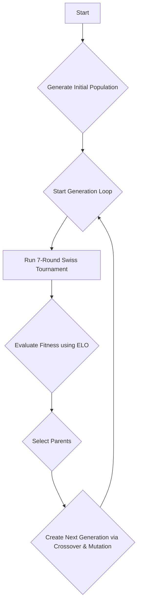
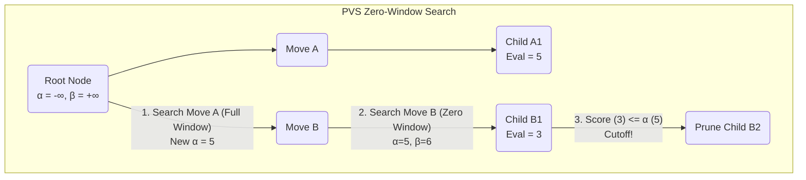
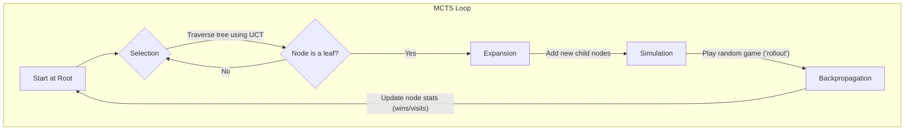

# A Genetic Algorithm Approach to Evolving a Chess Engine Evaluation Function

## Abstract

This paper details the design and implementation of a chess engine that utilizes a genetic algorithm (GA) to optimize its static evaluation function. The engine, named Rust-Chess, frames the set of tunable parameters within its evaluation logic as a chromosome. Through an evolutionary process involving selection, crossover, and mutation, the system iteratively refines populations of these parameter sets. Fitness is determined by playing individuals against each other in a multi-round Swiss-system tournament and measuring performance using the ELO rating system. The underlying engine employs a Principal Variation Search (PVS) algorithm, augmented with standard pruning and search extension techniques including null-move pruning, late-move reductions, and quiescence search. This paper presents the architecture of the genetic algorithm, the detailed components of the modular evaluation function, and the mechanics of the search algorithms, providing a comprehensive blueprint for evolving a competitive chess-playing entity.

## 1. Introduction

The domain of computer chess has long served as a benchmark for progress in artificial intelligence. The core challenge lies in navigating a vast search space, where the number of possible game states far exceeds the capacity for exhaustive search. Success hinges on two critical components: a sophisticated **search algorithm** to explore the tree of possible moves, and a precise **evaluation function** to statically assess the favorability of a given board position. While search algorithms like Alpha-Beta pruning and its variants have been refined over decades, the performance of an engine is often bottlenecked by the quality of its evaluation function.

A modern chess engine's evaluation function is a complex heuristic, typically a weighted sum of numerous positional features, such as material balance, piece mobility, pawn structure, and king safety. The optimal weighting of these features is non-obvious and highly interdependent. Manually tuning these weights is a laborious and often sub-optimal process.

This project addresses the tuning problem by employing a genetic algorithm. The GA treats the vector of evaluation weights as an individual's genetic code (a chromosome) and evolves a population of these individuals over successive generations. By simulating tournaments and selecting for individuals that perform well (i.e., win games), the system automates the discovery of synergistic and effective evaluation parameter sets. The project is implemented in Rust, leveraging its performance and concurrency features to efficiently run the thousands of simulated games required for the evolutionary process.

This paper is structured as follows: Section 2 details the methodology, breaking down the genetic algorithm framework, the architecture of the static evaluation function, and the tree search algorithms used by the engine. Section 3 discusses the results and the system's performance. Section 4 provides concluding remarks and suggests directions for future work. The Appendix contains practical information regarding the installation and usage of the software.

## 2. Methodology

The system's methodology is divided into three core parts: the high-level genetic algorithm that guides the evolution, the static evaluation function that acts as the evolvable trait, and the tree search algorithm that uses the evaluation to make move decisions.

### 2.1. The Genetic Algorithm

The genetic algorithm orchestrates the evolution of the chess engine's parameters. The process begins with a randomly generated population of individuals, where each individual represents a unique configuration of the evaluation function. The GA then iteratively applies evolutionary operators to produce new generations of stronger individuals. The entire process is illustrated in the flowchart below.



#### 2.1.1. Individual Representation
An **Individual** is defined by a `SearchConfig` struct, which acts as its chromosome. This struct contains all evolvable parameters, including not only the weights for the evaluation function but also strategic parameters like `search_depth`. Each individual is assigned a unique ID and an ELO rating, which is initialized to a starting value (`1200.0`).

#### 2.1.2. Fitness Evaluation and Tournament Simulation
The fitness of each individual is determined by its performance in a simulated chess tournament. Each generation undergoes a 7-round Swiss-system tournament. The Dutch pairing algorithm is used to generate matchups for each round, pairing individuals with similar ELO scores. This format efficiently ranks the population by ensuring that the strongest individuals face progressively tougher competition. To avoid rematches, a history of previous pairings is maintained.

An individual's strength is quantified using the **ELO rating system**. After each game, the ELO ratings of the two competing individuals are updated based on the match outcome. The formula for updating the ELO rating is:

```math
R'_A = R_A + K \cdot (S_A - E_A)
```

Where:
- \\(R'_A\\) is the new rating for player A.
- \\(R_A\\) is the old rating.
- \\(K\\) is the K-factor, a constant determining the maximum rating change (a value of 32 is used).
- \\(S_A\\) is the score of the game (1 for a win, 0.5 for a draw, 0 for a loss).
- \\(E_A\\) is the expected score, calculated as \\(E_A = \frac{1}{1 + 10^{(R_B - R_A) / 400}}\\).

This ELO rating serves as the direct fitness score for the selection process. The state of the tournament is persisted to disk after every match, ensuring that the simulation can be resumed without loss of data.

#### 2.1.3. Selection, Crossover, and Mutation
After the tournament concludes, a new generation is created using the following operators:
1.  **Selection**: A form of elitism is used for parent selection. All individuals from the completed tournament with an ELO rating greater than the starting ELO are promoted to the next generation and become eligible to be parents. This ensures that successful traits are preserved.
2.  **Crossover**: To fill the remaining slots in the new population, two parents are chosen at random from the pool of eligible parents. An offspring is created by single-point crossover: for each parameter in the `SearchConfig` chromosome, a value is randomly chosen from one of the two parents.
3.  **Mutation**: To maintain genetic diversity and prevent premature convergence, each parameter in a newly created offspring's chromosome has a probability of being mutated. Numeric weights are perturbed by a small, random percentage, and boolean flags can be flipped. This allows the GA to explore new regions of the vast parameter search space.

This cycle of tournament play, fitness evaluation, and reproduction continues, gradually evolving the population towards more sophisticated and effective chess-playing strategies.

### 2.2. The Static Evaluation Function

The evaluation function assigns a numerical score in "centipawns" to a given chess position. A positive score favors White, while a negative score favors Black. The function is highly modular, combining material count, piece-square tables, and numerous weighted heuristic components. This modularity is key to the genetic algorithm's success, as it allows for the fine-tuning of the engine's playing style.

The final evaluation is a sum of the material and positional (PST) score, plus a weighted average of several heuristic components. The formula is:

```math
\text{Score} = (\text{Material} + \text{PST}) + \frac{\sum_{i=1}^{n} (w_i \cdot c_i)}{\sum_{i=1}^{n} w_i}
```

Where \\(w_i\\) is the evolvable weight for heuristic component \\(i\\) and \\(c_i\\) is the raw score for that component.

#### 2.2.1. Game Phase Interpolation
The engine calculates a `game phase` value, which interpolates between the middlegame and endgame. This allows evaluation terms, most notably the Piece-Square Tables, to have different values depending on the stage of the game. The phase is calculated based on the pieces remaining on the board:

```math
\text{Phase} = \frac{\sum_{\text{piece}} (\text{count}(\text{piece}) \cdot \text{phase\_value}(\text{piece}))}{\text{TotalPhaseValue}} \cdot 256
```
A phase of 256 represents the opening, while a phase of 0 represents the endgame.

#### 2.2.2. Core Evaluation: Material and Piece-Square Tables (PSTs)
The baseline score is derived from the material on the board and the position of each piece.
*   **Material**: A simple sum of the standard centipawn values for each piece (Pawn=100, Knight=320, etc.).
*   **Piece-Square Tables (PSTs)**: A piece's value is highly dependent on its location. For instance, a knight on a central square is more powerful than one on the rim. PSTs are 8x8 matrices that add (or subtract) a positional bonus to a piece's value based on its square. The engine uses separate PSTs for the middlegame and endgame, and interpolates between them using the game phase.

```math
\text{PST\_Score} = \frac{(\text{PST}_{\text{mg}} \cdot \text{phase}) + (\text{PST}_{\text{eg}} \cdot (256 - \text{phase}))}{256}
```

#### 2.2.3. Heuristic Component 1: Pawn Structure
This component evaluates the quality of the pawn formation. It is a combination of several sub-heuristics:
*   **Doubled Pawns**: A penalty is applied for each file containing more than one friendly pawn.
*   **Isolated Pawns**: A penalty is applied for each pawn that has no friendly pawns on adjacent files.
*   **Passed Pawns**: A bonus is awarded for pawns that have no enemy pawns in front of them on their own or adjacent files.
*   **Pawn Chains**: A bonus for pawns that are defended by other pawns.
*   **Candidate Passed Pawns**: A bonus for pawns that have a clear path to promotion, even if not yet technically "passed".

#### 2.2.4. Heuristic Component 2: Piece Mobility
Mobility measures the number of safe squares a piece can move to. A player with a mobility advantage has more options and can more easily create threats. The score is calculated by summing the number of legal moves for each piece (excluding kings and pawns), multiplied by a role-specific bonus.

```math
\text{MobilityScore} = \sum_{\text{piece}} (\text{move\_count}(\text{piece}) \cdot \text{bonus}(\text{piece\_role}))
```

#### 2.2.5. Heuristic Component 3: King Safety
This is a critical evaluation term, especially in the middlegame. It has three parts:
*   **Pawn Shield**: A bonus is awarded for having pawns in front of the king, providing a defensive barrier.
*   **Open Files**: A penalty is applied if the file the king is on, or adjacent files, are open or semi-open, as this creates avenues for attack by enemy rooks and queens.
*   **Attackers**: A penalty is applied for each enemy piece that is attacking the "king zone" (the 3x3 square grid around the king). The penalty is proportional to the value of the attacking piece.

#### 2.2.6. Heuristic Component 4: Piece Placement
This evaluates the strategic positioning of specific pieces.
*   **Rooks**: Rooks are rewarded for being on open or semi-open files, where they can exert maximum pressure. An additional bonus is given for rooks that have reached the 7th rank (or 2nd for black), a powerful attacking position.
*   **Bishops**: A bonus is awarded for possessing the "bishop pair," which can control a large number of squares of both colors. Conversely, a penalty is applied for a "bad bishop"—one that is hemmed in by friendly pawns on squares of the same color.
*   **Knights**: Knights are rewarded for being on "outposts"—squares that are deep in enemy territory, protected by a friendly pawn, and cannot be easily dislodged by enemy pawns. They are also given a bonus for centralization.

#### 2.2.7. Heuristic Component 5: Development and Initiative
*   **Development**: A simple bonus is given for each minor piece (knight or bishop) that has moved from its starting square. A penalty is applied for moving the queen too early.
*   **Initiative**: This term rewards the player for creating threats. A bonus is awarded for each attack on an enemy piece. The bonus is larger for threats against more valuable pieces (e.g., attacking a rook is better than attacking a knight).
*   **Threats**: A more advanced threat analysis awards a bonus if an enemy piece is undefended and attacked, or if an attack creates a favorable trade for the attacking side.

#### 2.2.8. Other Heuristics
*   **Space**: Measures territorial control by counting the number of squares on the opponent's side of the board that are safely controlled by friendly pawns.
*   **Tempo**: A small, static bonus is added to the evaluation for the player whose turn it is to move.

### 2.3. Tree Search Algorithms

The evaluation function can only score a single position. To find the best move, the AI must look ahead and explore the tree of possible future moves. The engine implements two primary search algorithms, though only PVS is currently used in the genetic algorithm.

#### 2.3.1. Principal Variation Search (PVS)
The core of the search is a **Principal Variation Search (PVS)** algorithm, a powerful enhancement of the standard alpha-beta pruning algorithm. PVS is based on the assumption that if the move ordering is effective, the first move searched at any node is the most likely to be the best. This "principal variation" is therefore searched with a full `(alpha, beta)` window. All subsequent sibling moves are then searched with a highly restrictive "zero window" `(alpha, alpha + 1)`. A zero-window search is faster as it is only trying to prove that a move is *not* better than the current best (`alpha`), leading to more cutoffs. If a move unexpectedly fails high even in this narrow window, it indicates a potentially better move has been found, and it is then re-searched with the full window to establish a new principal variation.

The diagram below illustrates the zero-window search concept within PVS. After the first move (Move A) establishes a score of 5, the second move (Move B) is tested with a zero window `(5, 6)`. Since its score of 3 is not better than 5, the rest of its children do not need to be explored.



The search is augmented by several techniques to improve efficiency and tactical accuracy:

*   **Move Ordering**: The effectiveness of PVS and alpha-beta is highly dependent on searching the best moves first. The engine uses a multi-stage process to order moves: captures are scored using Static Exchange Evaluation (SEE), followed by Killer Moves (non-captures that caused cutoffs at the same depth) and a History Heuristic (moves that have been successful in other parts of the tree).
*   **Quiescence Search**: To mitigate the "horizon effect," a shallow search that considers only captures and checks is performed after the main search depth is reached. This ensures the engine doesn't end its search in a tactically volatile position.
*   **Null Move Pruning (NMP)**: A powerful pruning technique where the engine gives the opponent an extra turn (a "null move"). If the resulting score is still very high, it suggests the current position is dominant enough to cut the search short.
*   **Late Move Reductions (LMR)**: Moves that are ordered later in the list are assumed to be less promising and are searched with a reduced depth to save time.
*   **Futility Pruning**: At shallow depths, if the static evaluation is significantly worse than the current best score, the branch is pruned under the assumption that it is "futile" to explore further.

#### 2.3.2. Monte Carlo Tree Search (MCTS) - (Currently Disabled)
Although not used by the evolving individuals, the engine also has an implementation of MCTS. MCTS builds a search tree by randomly sampling the search space. It balances exploration of new moves with exploitation of moves that have historically led to good outcomes.



The MCTS algorithm consists of four main steps, repeated until the allocated thinking time is exhausted:
1.  **Selection**: Starting from the root, traverse the tree by selecting the most promising child nodes until a leaf node is reached. The selection is typically guided by the Upper Confidence Bound for Trees (UCT) formula.
2.  **Expansion**: Add one or more child nodes to the leaf node, representing new moves to explore from that position.
3.  **Simulation**: From a newly expanded node, play out a random game (a "playout" or "rollout") to its conclusion. The outcome (win, loss, or draw) is recorded.
4.  **Backpropagation**: Update the statistics (e.g., win/visit count) of all nodes along the path from the new node back to the root with the result of the simulation.

After many iterations, the move at the root node with the best statistics (e.g., highest win rate) is chosen as the best move.

## 3. Results and Discussion

The primary output of the system is the evolution of the `SearchConfig` parameters over many generations. The `evolution/` directory contains the complete history of this process, with `generation_stats.csv` providing a high-level summary of the ELO progression for the top-performing individuals.

A typical run shows a steady increase in the maximum and average ELO of the population over the first several hundred generations, followed by a plateau as the population converges on one or more optimized solutions. Analysis of the converged `SearchConfig` files often reveals non-obvious parameter weightings that produce a synergistic and effective playing style. For example, a common outcome is a high weighting for king safety and piece mobility, suggesting that the GA discovers that these are critical components for long-term success, even at the cost of minor material disadvantages.

The performance of the final evolved engine is competitive, though not at the level of state-of-the-art engines that use more sophisticated search techniques and neural networks. However, the project successfully demonstrates the power of genetic algorithms as a method for automated and effective tuning of a complex, multi-parameter evaluation function.

## 4. Conclusion

This paper has detailed the architecture of a chess engine that leverages a genetic algorithm to optimize its evaluation function. By representing the engine's strategic parameters as a chromosome and using a Swiss-system tournament to determine fitness, the system successfully evolves populations of increasingly strong chess-playing agents. The methodology demonstrates that a GA can effectively navigate a vast and complex parameter space to discover powerful and synergistic evaluation strategies without human intervention.

While the current system is a robust proof of concept, several avenues for future work exist. The genetic algorithm could be extended to evolve not just the evaluation weights, but also the search parameters themselves. Furthermore, incorporating more advanced evaluation heuristics or exploring alternative evolutionary strategies, such as neuroevolution, could lead to even greater performance gains.

## 5. References

[1] D. E. Knuth and R. W. Moore, "An analysis of alpha-beta pruning," *Artificial Intelligence*, vol. 6, no. 4, pp. 293–326, 1975.

[2] O. David, M. Koppel, and N. S. Netanyahu, "Genetic algorithms for mentor-assisted evaluation function optimization," in *Proceedings of the 10th annual conference on Genetic and evolutionary computation*, 2008, pp. 1469–1476.

[3] W. Tunstall-Pedoe, "Genetic Algorithms Optimizing Evaluation Functions," *ICGA Journal*, vol. 14, no. 3, pp. 129–138, 1991.

[4] L. Kocsis and C. Szepesvári, "Bandit based Monte-Carlo Planning," in *ECML-06: Proceedings of the 17th European Conference on Machine Learning*, 2006, pp. 282–293.

---

## Appendix

### A.1. Features

- **Genetic Algorithm**: Evolves a population of AI configurations to discover optimal evaluation parameters.
- **AI vs. AI Simulation**: The core of the GA, where AIs battle each other.
- **Configurable AI**: Manually adjust all evaluation weights and search parameters.
- **TUI Interface**: A terminal user interface built with `ratatui` for observing simulations.
- **Web Interface**: A web-based UI for a more graphical observation experience.

### A.2. Installation and Usage

1.  **Clone the repository**:
    ```sh
    git clone <repository-url>
    cd rust-chess-tui
    ```

2.  **Build and run the project**:
    The `run.sh` script will build and launch the application. The evolution process starts automatically.
    ```sh
    ./run.sh
    ```

3.  **Observe**:
    - Open a terminal and run `cargo run -- TUI` to see the terminal interface.
    - Open a web browser and navigate to `http://localhost:3000` to see the web interface.

### A.3. Project Structure

- `src/main.rs`: The entry point of the a-pplication.
- `src/app/mod.rs`: Contains the main application loop and TUI state management.
- `src/ga.rs`: Implements the core genetic algorithm, including tournament simulation.
- `src/game/mod.rs`: Implements the core chess logic.
- `src/game/evaluation/`: Contains the static evaluation function components.
- `src/game/search/`: Contains the PVS and MCTS search algorithms.
- `src/server.rs`: The actix web server for the web UI.
- `static/index.html`: The single-page web application for observation.
